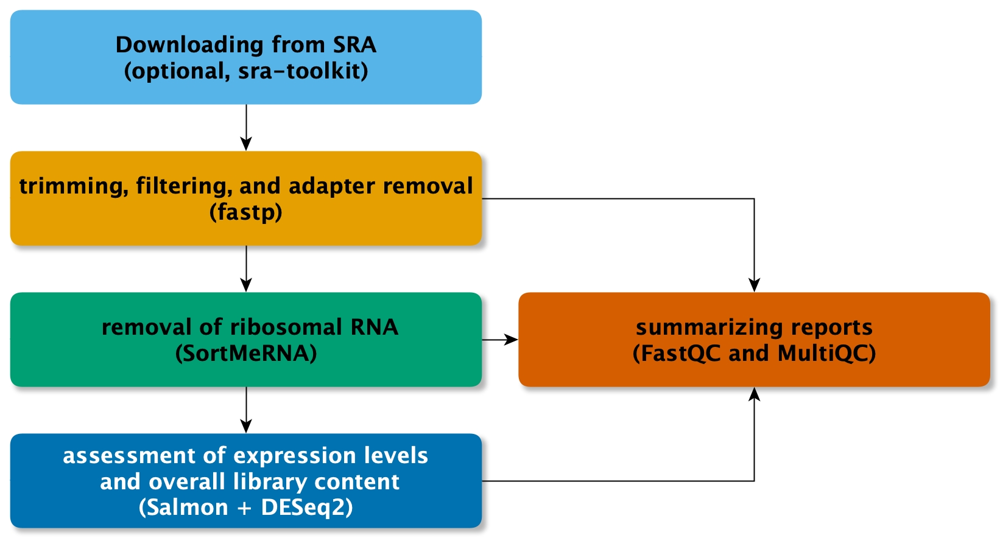

# RNA-Schlange

The *RNA-Schlange* (German word for *snake*)
pipeline assesses the quality of RNA-seq data in a
plug and play approach. Thus, a user should not need to provide any additional
configurations aside from providing the read files, the genome, and
a rudimentary sample sheet file.
This pipeline supports both **microbial** and **eukaryotic** experimental data,
as well ass both **single-end** and **paired-end** sequencing data.
Alternatively, a user can specify a set of SRA runs that should be downloaded.
If you use the *RNA-Schlange*, please consider citing:

"Genome-scale prediction of stable housekeeping genes in Synechococcus sp. PCC 7002".  
Adrian Sven Geissler, Elena Carrasquer Alvarez, Christian Anthon, Niels-Ulrik Frigaard, Jan Gorodkin, Stefan Ernst Seemann. 
*in preparation*

RNA-Schlange uses the following tools:

- **sra-toolkit** for downloading data from SRA
- **fastp** for trimming, filtering, and adapter removal
- **SortMeRNA** for removal of ribosomal RNA
- **Salmon** + **DESeq2** to quickly assess expression levels and
  over library content
- **FastQC** + **MultiQC** for reporting and summarizing quality reports

## Setup

- Install [conda](https://docs.conda.io/en/latest/miniconda.html#)
- install Snakemake and mamba

        $ conda install -n base -c conda-forge mamba
        $ mamba install -c bioconda snakemake

- Download this pipeline

        $ git clone asgeissler/RNA-Schlange
    
When using the `run.sh` helper script,
Snakemake will automatically install
the remaining dependencies (*e.g.* fastp)
by creating new conda environments within the workflow directory.

## User guide

All computations and data will be stored within the directory in which
you downloaded this pipeline. There are two scenarios on how to use
RNA-Schlange:

### Scenario 1: User provided reads

In case you have RNA-seq data of your own, please create a folder `data`
and place your files there.
Also provide the genomic sequence and annotation for your organism of
interest; please name the files
`genome.fna.gz` and `genome.gff.gz`.
You might want to download them from
either [RefSeq](https://www.ncbi.nlm.nih.gov/refseq/),
[ENA](https://www.ebi.ac.uk/ena/browser/home), or
a species specific  

Finally, write a file `samples.csv` that describes each 
read file that you have provided in `data`.
The file should be comma separated (that is a ',' between each value)
and contain the columns 'file', 'batch', 'sample', and 'condition'.
If your experiment is a pair-end RNA-seq dataset, also add the optional
'pair' column.

In case that your sequencing facility provides md5 checksums, consider
writing a `checksum.txt` file  of the form

        abc032358XXX  file1_1.fast.gz
        XYZ987654321  file1_2.fast.gz
        ....

RNA-Schlange will then initiate a comparison of hash to verify that there
were not issues during the download.

For example, the input data could look like:

        ├── data
        │   ├── file1_1.fastq.gz
        │   ├── file1_2.fastq.gz
        │   ├── file2_1.fastq.gz
        │   ├── file2_2.fastq.gz
        │   └── ...
        ├── genome.fna.gz
        ├── (checksum.txt) # optional
        ├── genome.gff.gz
        ├── samples.csv

With the file `samples.csv` describing the reads

        batch,sample,condition,pair,file
        batch1,A,control,R1,file1_1.fastq.gz
        batch1,A,control,R2,file1_2.fastq.gz
        batch1,B,control,R1,file2_1.fastq.gz
        batch1,B,control,R2,file2_2.fastq.gz
        ...

The pipline will compute an analysis folder (see below) in which
all files corresponding to the samples are names
`batch_sample_condition`. Therefore the pipeline only accepts
sample/condition/batch with
alpha-numeric names (incl. dash, `-0-9a-zA-Z`).
For paired-end reads, the values for the pairs are either R1 or R2.

### Scenario 2: Public data

RNA-Schlange supports you to specify 
run accession numbers to download from the
(SRA)[https://www.ncbi.nlm.nih.gov/sra] database.
All you needed to specify is a comma separated file
specifying the 'run' and 'condition'.
If the data that will be downloaded is single-end, please
name the file `sra-SE.csv`.
For paired-end data name the file `sra-PE.csv.

A hypothetical `sra\*.csv` should look like:

        run,condition
        SRR12345,control
        SRR12345,control
        SRR12345,case
        SRR12345,case

## Pipeline execution

All that is needed to start the pipeline is to execute the helper script with:

        bash run.sh

If you specified the data via SRA entries, you would need to run the script
twice (once for the download and once for the quality assessment).
In the helper script, Snakemake is set to automatically install the software
dependencies with conda.

### Cluster execution and singularity

Alternatively, if you prefer the computations to run in a cluster,
RNA-Schlange comes with support for *slurm*.
Simply use `bash run_slurm.sh` after adapting the configurations to you
system in `clusterprofile_slurm/config.yaml`.

If you prefer to use singularity to handle the dependencies,
then please use
`bash run_slurm_singularity.sh` and the configuration
`clusterprofile_slurm_singularity/config.yaml`.
For this use case, the pipeline will download a pre-build 
containerized 
[containerized](https://snakemake.readthedocs.io/en/stable/snakefiles/deployment.html#containerization-of-conda-based-workflows)
image that includes all dependencies. Thanks to the ORAS standard,
you can use this image also for a docker environment.

**Recommendation:** Set the `conda-prefix` and `singularity-prefix`
to paths on your server for centralized storage of the dependencies and
container images.
Then dependencies won't be re-installed for each new workflow instance
(saving time and storage).

**Note on SRA downloading:** Due this pipelines internal coding to conditionally
handle user provided or SRA deposited RNA-seq data, it is not possible to
split the downloading part into multiple jobs. Uset the
`run.sh` or `run_singularity.sh` helpers for the downloading part
(can be submitted to a queue as a single job).

## Pipeline analysis output

All computatioal results of the pipeline are stored in the `analysis`
directory.

If you provided a `checksum.txt` file that specified the
per fastq file the expected checksums (see above), then
the pipeline creates states the observed checksums in
`checksum.txt` with potential difference to the expected
checksums listed in `differing-checksum.txt`.

The intermediary results of the pipeline are stored
in computaitonal-chronological order as indicated by numeric
prefixes per folder:

- `10_raw`:  
  Contains symbolic links to the files in `data` but
  with renaming to `batch\_sample\_condition(\_pair)`

- `11_discarded`, `11_unpaired`, `12_clean`:  
  These folders contain the discarded, unpaired, and quality filtered
  clean reads, as processed by **fastp**.

- `13_report/\*.html`:  
  Per file, **fastp** procudes html accessible reports that showcase
  the before/after filtering statistics. Additionally, the report
  shows detailed statistics onj
  potential adapter contamination or distribution of insert sizes of
  paired-end reads.

- `15_fastqc/10_raw`, `15_fastqc/12_clean`, `50_fastqc_before`,
  and `51_fastqc_after`:  
  **FastQC** is a popular tools for reporting sequenceing reads quality.
  The `15_fastqc` folder contains the indibidual reports, while
  the comprehensive **MultiQC** report that aggregates the information
  from all files are in the `50_fastqc_before` and `51_fastqc_after`
  folder.

- `20_db`, `21_ribosomal_RNA`, `22_non-ribosomal_RNA`:  
  These directories correspond to the ribosomal RNA filtering
  of **SortMeRNA**.

- `30_genes.fna.gz`, `31_salmon_index`, `32_salmon`:  
  For a quality control assessment of expression levels,
  RNA-Schlange quantifies expression for all genes (coding and non-coding)
  annotated in the user-provided `genome.gff.gz` with **Salmon**.
  There files and folders contain the index for the gene sequences
  and the output files of **Salmon**.

- `40_survey`:  
  Based on the expresison levels, this folder contains the
  information on

1. The combined expression count matrix collected from
   the individual Salmon runs in `counts.tsv`.
1. Relative biotype of expressed genes shown in the barplot
   `biotype-content.png`.
1. Scatter plots between the samples in a condition
    `scatter-plots.png`.
1. A printicpal component analysis (PCA) plot with 
   condition and batch indication of the top $100$ genes with 
   most variance in expression `pca.png`.
1. A tentative analysis of differentially expressed genes
  as detected by **DESeq2** at a false-discovery rate (FDR) of
  $0.05$ (see optional parameters below) are in
  `putative-diff-expression-summary.tsv` and
  `putative-diff-expression.tsv`.
1. Finally, a heatmap showing expression levels of the putative
  differentially expresses genes is shown in 1heatmap.png`.

- `53_main_multiqc`:  
  A summarizing **MultiQC** report of the filtering, ribosomal removal,
  and expression levels quantification.

## Optional configurations

RNA-Schlange attempts to provide a near configuration-free 
experience of assessing the overall RNA-seq data quality.
However, a user could still adapt pipeline in the
`config.yaml` file, which is format in
the 
[YAML format](https://en.wikipedia.org/wiki/YAML#Basic_components).

### fastp quality filtering

The default paramters are set to

- Ensure a an overall average 
  [Phred score](https://en.wikipedia.org/wiki/Phred_quality_score)
  quality above $20$ (probabity of incorrect base call $< 0.01$).
- Less then $10\%$ of positions are read are under a score of $20$.
- Reads have a minimal length of $40$ nucleotides.
- The adapter contamination and clipping is done for the
  Illumina universal adapter sequences
 
        fastp_args: [
          '--average_qual=20',
          '--qualified_quality_phred=20',
          '--unqualified_percent_limit=10',
          '--length_required=40',
          '--adapter_sequence=AGATCGGAAGAGCACACGTCTGAACTCCAGTCA',
          '--adapter_sequence_r2=AGATCGGAAGAGCGTCGTGTAGGGAAAGAGTGT'
        ]

Alternative parameters are shown in the 
[fastp handbook](https://github.com/OpenGene/fastp), which allow for:

- De-duplication
- Unque molecular identifier (UMI) processing
- polyX tail trimmign
- global trimming

Although fastp allows for an automatic adapter sequence detection,
the pipeline states the Illumina universal adapter sequences
for explicitly checking for potential contamination by these sequences.
Alterantive adapter sequences are listed `adapter_list.fa`.

### SortMeRNA ribosomal RNA removal

Per default, the 16S, 18S, and 23S ribosomal RNAs are
choosen for the removal steps.
The removal is relative to represantative squences collected
by **SortMeRNA**. Additional
filter sets are listed in the
[handbook](https://github.com/biocore/sortmerna/wiki/User-manual-v4.0].

        sortmerna: [
          'silva-bac-16s-id90',
          'silva-arc-16s-id95',
          'silva-euk-18s-id95',
          'silva-bac-23s-id98',
          'silva-arc-23s-id98',
          'silva-euk-28s-id98'
        ]

### DESeq2 analysis

The assessment of putative 
differential gene expression is per default relative to the
FDR $\alpha = 0.05$. An alternative significance level can be specified
in the configuraiton.
Further, if any of the generated plots might in their dimension not
be suitable for a dataset, other sizes can be specified.
The dimensions of the plots is given as a string of the format
'<width>x<height>' in inches.

        dge: {
          alpha: 0.05,
          dim_pca: '12x8',
          dim_scatter: '20x20',
          dim_biotype: '8x6'
        }

## Developer note

When using this pipeline in it's containerized form (*e.g.*
`run_singularity.sh`), then an image that was build with the following commands
will be downloaded.

        # After a complete run of the pipeline, snapshot the conda envs
        snakemake --containerize > Dockerfile
        # Convert to a singularity file
        # mambaforge does not have curl installed -> use wget
        # `curl URL -o PATH` becomes `wget URL -O PATH`
        # spython incorrectly doubles the '/environment.yaml/environment.yaml'
        spython recipe Dockerfile                              | \
            sed 's,curl \([^ ]*\) -o \([^ ]*\),wget \1 -O \2,' | \
            sed 's,/environment.yaml/environment.yaml,/environment.yaml,' > Singularity
        singularity build --fakeroot rnaschlange-0.1.sif Singularity
        # setup repositry credential
        singularity remote login --username <USER> oras://ghcr.io
        # + enter secret access token
        # upload image
        singularity push rnaschlange-0.1.sif oras://ghcr.io/asgeissler/rnaschlange:0.1
